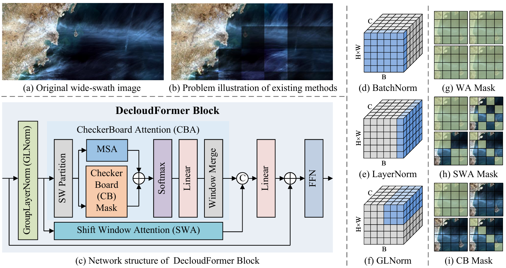

#  DecloudFormer: Quest The Key to Consistent Thin Cloud Removal of Wide-swath Multi-spectral Image
 Official implementation.

---

by Mingkai Li, Qizhi Xu, Kaiqi Li and Wei Li. 
Beijing Institute of Technology

### Abstract



Wide-swath images contain clouds of various shapes and thicknesses. Existing methods have different thin cloud removal strengths in different patches of the wide-swath image. This leads to severe cross-patch color inconsistency in the thin cloud removal results of wide-swath images. To solve this problem, a DecloudFormer with cross-pacth thin cloud removal consistency was proposed. First, a Group Layer Normalization (GLNorm) was proposed to preserve both the spatial and channel distribution of thin cloud. Second, a CheckerBoard Mask (CB Mask) was proposed to make the network focus on different cloud-covered areas of the image and extract local cloud features. Finally, a two-branch DecloudFormer Block containing the CheckerBoard Attention (CBA) was proposed to fuse the global cloud features and local cloud features to reduce the cross-patch color difference. DecloudFormer and compared methods were tested for simulated thin cloud removal performance on images from QuickBird, GaoFen-2 and WorldView-2 satellites, and for real thin cloud removal performance on images from Landsat-8 satellite. The experiment results demonstrated that DecloudFormer outperformed the existing State-Of-The-Art (SOTA) methods. 
Furthermore, DecloudFormer freed most GPUs from memory limitations to process wide-swath images.


### Network

DecloudFormer is a five-phase UNet structure consisting of five DecloudFormer Layers. Each DecloudFormer Layer consists of two kinds of DecloudFormer Blocks. The first kind of DecloudFormer Block is called Block-w and contains Window Attention and Shifted Window Attention. The second kinds of DecloudFormer Block is called Block-c and contains Checkerboard Attention and Shifted Window Attention.


The calculation process for the three kinds of attention. First, the input patch was divided into windows and Window Attention was computed. Second, the windows were shifted and Shifted Window Attention and Checkerboard Attention were computed. Then, the network was made to pay attention to different cloud regions in the patch by applying different masks. After putting all the patches back together into a wide-swath image, the region where Checkerboard Attention was computed was in the shape of a checkerboard.

### Usage
#### Test

Trained_models are available at google drive: https://drive.google.com/file/d/1H-iEAT94sYso07W4PDmEOWhGU9gZ-Xgy/view?usp=sharing

*Edit the test image path, save path and the trained model path in test.py.*


 ```shell
 python test.py 
```

